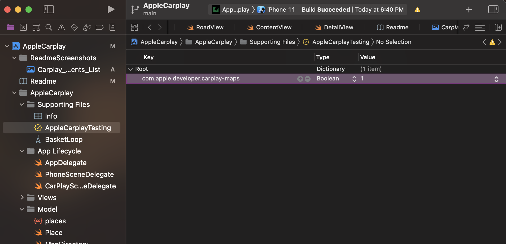
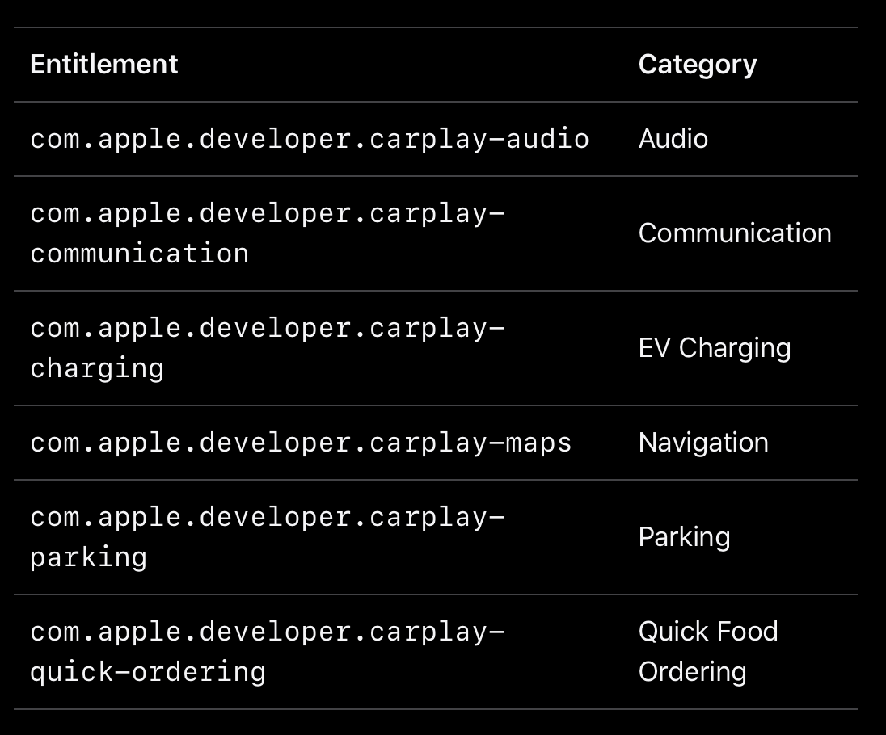
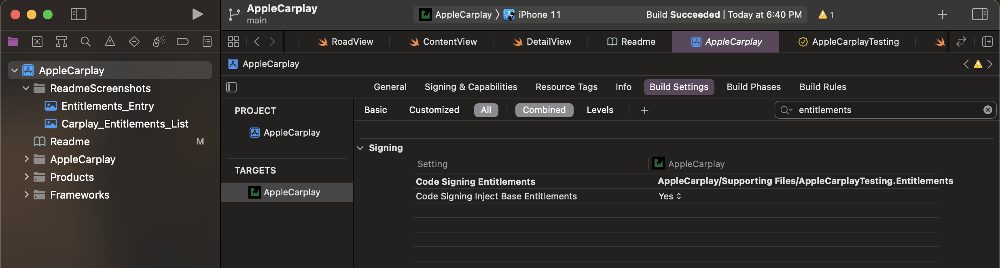
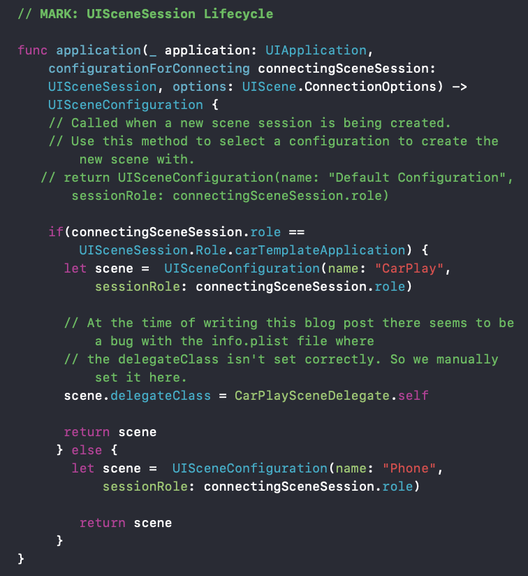

# Apple Carplay Example

[](http://unlicense.org/)

This application is an example of how to implement Carplay Functionality to a pre-existing iOS application. In order to add Carplay Functionality to an application, you will be working in the Scene Delegate and App Delegate portion of your code.

<br />
<br />

## Adding the Carplay Architecture to Your Preexisting App

Adding Carplay Functionality involves three overall processes:

- Adding Entitlements to your Code

- Requesting the Carplay Entitlement from Apple in order to test your application in a vehicle.

-  Working with the Scene And App Delegate to implement Carplay Capabilities

The specifics of these two steps will be discussed below.

<br />
<br />

## Adding Entitlements to your App

You first have to add an entitlement file to allow for the application to have permission to use Carplay capabilities.

1. Within this application, the entitlements file is named AppleCarplayTesting.entitlements and is located in the folder AppleCarplay/"Supporting Files". You can use this file as a template for your own application.

2. To add your own Entitlements file, right-click and select "New File". Select a "Property List" File under the "Resources" header.

3. Rename this Property List File to anything you want, but give the file format of ".entitlements". For example, when you create this property list file, rename it "Carplay.Entitlements"

4. Within the Entitlements file, you will want to add a specific carplay capability in the format of the screenshot below:

<br />



<br />

5. Depending on what carplay capabilities you want to use, add a specific capability based on the screenshot below of the list of capabilities:

<br />

<br />

6. Open the project's Build Settings and ensure your Code Signing Entitlements points to your created Entitlements file like the screenshot below:

<br />


<br />

Ensure that the file location is entered correctly based on the root of the project.

<br />
<br />

## Requesting Carplay Entitlements from Apple

So you are able to test the Carplay Functionality and Capabilities of your application in the Simulator by going into the I/O options for the simulator and choosing the Carplay Option to test. However in order to test your application on a device, on an actual vehicle and to deploy the app to the app store... You will need to go to Request Entitlements from Apple.

1. First, You need to have a Developer Account. A Developer account cost $100 USD per year....

2. Once you have a developer account, you have to contact Apple [here](https://developer.apple.com/contact/carplay/) to ask Apple to add Carplay Capabilities to your developer account. Otherwise, you won't be able to test on a device and can only test on a simulator. You will have to send a link to Apple showing them your code so they can inspect it.

3. If Apple approves your request to add Carplay Entitlement permissions to your developer account, you will have to then add Carplay capabilities to your particular application. Rather then me writing this all it for you, it will be easier to just read Apple's Docs explaining this process [here](https://developer.apple.com/documentation/carplay/requesting_carplay_entitlements).


In summary each app is signed to a certain developer account. A user's apple device or vehicle with Carplay capabilities will check the developer account that the app is signed to to see what this developer account is allowed to do. If the app passes the security and capabilities check, the App can run. By default, a developer account doesn't have Carplay capabilities possibly for security and quality control purposes. So you have to ask Apple to add Carplay Capabilities to your developer account in order for your carplay app to run in a vehicle.
<br />
<br />
  

## Working with Scene and App Delegate

The Scene and App Delegate basically specifies what the application will do when events such as application start, application disconnect, phone calls occur, and/or connecting an iPhone to a Carplay compatible vehicle occurs... Basically actions involving the iphone external to that of the UI of the App.

In order to understand the architecture of a Carplay App, we will just use this current Carplay Application as an example:

1. The first file to look at is the AppDelegate file. It is located in "/AppleCarplay/App Lifecycle/AppDelegate.Swift". We are specifically looking at this function in the screenshot below:


    


2. The code in the above screenshot basically describes what will happen if you connect the application under certain conditions. 

    If the device is not connected to a carplay device, only the Phone Version of the application will be loaded and it will show up on the phone by loading the "PhoneSceneDelegate Class"

    If the device is connected to a carplay device, both the phone and carplay version will be loaded. The PhoneSceneDelegate and CarPlaySceneDelegate classes will be loaded.
    
3. The Second file to look at in terms of Carplay functionality is the CarPlaySceneDelegate file. It is located in "/AppleCarplay/App Lifecycle/CarPlaySceneDelegate.Swift".

4. The CarPlaySceneDelegate file contains various functions that load predesigned templates created by Apple to do different things. There is a different tamplate  for Audio, Coomunication, EV Charging, Navigation, Parking and Quick Food Ordering

    The reason Apple creates a restrictive set of Templates that a developer has to work within is of Apple's strict Human interface Guidelines for a Carplay Application. Apps displayed on a vehicles touchscreen should not be too cluttered, distracting and complex that it can divert a driver's attention from the road. Obviously too much distraction from the road can cause a car accident and possible fatalities which is one of the reasons why Apple is so strict.
    
    Apple's Designers have designed a set of Templates to both reduce chances of road accidents due to distracting app design and to also fit in with Apple's Design aesthetic.
    
    5. The CarPlaySceneDelegate file loads predefined Templates that Apple has created. The actual configuration of the Templates are defined in the TemplateManager files in the Controllers folder.  


    6. The last file to look at is the TemplateManager.swift file. This file actually configures the Template once the CarPlaySceneDelegate file loads and sets up the Template.  This file is located in "/AppleCarplay/Controllers/TemplateManager.Swift"
    
    7. The Template Manger actually builds the UI that will be displayed on the car's touchscreen display. 
    
    8. The TemplateManager file also loads views and puts them together.

<br />
<br />

## Working with CarPlay Templates

As discussed before, CarPlay Templates are premade modules created by Apple to build apps that involve either one of the following:

    1. Audio
    2. Communication
    3. EV Charging
    4. Navigation
    5. Parking
    6. Quick Food Ordering
    
In order to understand how to use the templates in more detail, read the [Carplay Programming Guide](https://developer.apple.com/carplay/documentation/CarPlay-App-Programming-Guide.pdf)

<br />
<br />

## In Summary

The Architecture of the Carplay Application goes in this direction from the highest to lowest level:

```
AppDelegate -> CarplaySceneDelegate -> TemplateManager -> Views
```

<br />
<br />

## Resources:

- [Enhance Existing Apps with Carplay](https://adapptor.com.au/blog/enhance-existing-apps-with-carplay)
- [Scene and App Delegate Setup](https://developer.apple.com/documentation/carplay/integrating_carplay_with_your_navigation_app)
- [Carplay Programming Guide](https://developer.apple.com/carplay/documentation/CarPlay-App-Programming-Guide.pdf)

<br />
<br />
 
## Prerequisites and Deployment

- Mac computer to develop for iOS
- XCode 11.0 or later
- For testing on a device, use a device that can run the following OS versions: iOS 13.0+, iPadOS 13.0+, macOS 10.15+, Mac Catalyst 13.0+, tvOS 13.0+, watchOS 6.0+

<br />
<br />

## Built With

- Xcode
- SwiftUI

<br />
<br />

## Author

**Lam Nguyen**

<br />
<br />

## License

The Unlicense


